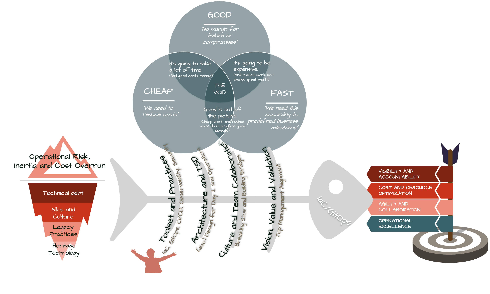

# Unveiling the GitOps Fish Series

In IT, few concepts have had as much transformative impact as DevOps and one of its siblings, GitOps. These methodologies promise to usher organisations into a new era of efficiency, agility, and innovation. However, merely adopting a DevOps or GitOps label without genuinely understanding its underlying principles is akin to setting sail on treacherous waters without a map or compass.

With the GitOps Fish, I intend to share my opinions/experience with IT professionals and organisational leaders through the layered depths of GitOps adoption. The diagram in this series is segmented into four pivotal sections, each shedding light on a crucial aspect of the GitOps journey (sharing most of the findings with any other DevOps derivative initiative).

Embarking on a GitOps journey is not merely about adopting a new set of tools or practices; it's about comprehensively understanding the interplay between management alignment, culture, technical design, and tool selection. Throughout this series, I will try to decode each facet to ensure organisations navigate this transformative journey effectively, recognising that success in GitOps, as in all IT endeavours, is as much about the people and principles as it is about the technology.

The heart of this series of articles lies in the Central Section: the fishbone diagram of GitOps. Just as each bone in a fish's spine plays a vital role in its movement and structure, each leaf of this diagram is fundamental to the successful adoption and scaling of GitOps. From achieving top management alignment to breaking silos for genuine team collaboration to designing resilient architectures and selecting the right toolset, understanding these components is paramount.

**Why focus on top management alignment?** 
Top management alignment is paramount in the GitOps/DevOps journey because it sets the transformation's tone, direction, and pace. With a synchronised vision from the top, efforts can become cohesive, even when priorities may shift unpredictably, and resources might be allocated effectively. Furthermore, with leadership buy-in, teams can better navigate organisational challenges, push past traditional barriers, and secure necessary resources. Focusing on top management alignment ensures that the GitOps/DevOps transformation isn't just an isolated IT initiative but a cohesive organisational shift towards efficiency, agility, and innovation.

**How can we break silos and foster genuine collaboration?** 
Breaking silos and fostering genuine collaboration are pivotal components in realising the full potential of GitOps/DevOps. Silos, by nature, lead to isolated knowledge pockets and hinder the flow of information, while genuine collaboration ensures that knowledge, best practices, and innovations are shared across teams. To shatter these barriers, organisations must invest in open communication platforms, encourage interdisciplinary learning, and create environments where sharing and collective problem-solving are the norm. Establishing rituals, like regular cross-functional meetings and collaborative design reviews, can also aid in building bridges between teams. By actively breaking down silos, organisations can ensure that GitOps/DevOps transformations are holistic and that every stakeholder is onboard, informed, and contributing to the collective goal.

**What does designing for "Day 2" really mean?** 

Designing for 'Day 2' goes beyond the initial setup and launch of an IT project, focusing on a system's long-term viability, maintainability, and scalability. While 'Day 1' often revolves around deployment and getting the system 'live', 'Day 2' delves into the challenges of real-world operations, including monitoring, troubleshooting, updates, security patches, and scaling to meet fluctuating demands. It emphasises the need for architectures and solutions that are not just functional on launch day but are built with foresight for the myriad of operational challenges that will inevitably arise in the days to follow. By prioritising 'Day 2' in design strategies, organisations can ensure their systems remain resilient, efficient, and adaptable, making them better equipped to handle unforeseen challenges and the evolving needs of the business.

**Which tools and practices truly resonate with GitOps principles?** 

Embracing GitOps principles requires a strategic selection of tools and practices seamlessly integrating with its core tenets. At the heart of GitOps is the belief in using Git as the 'single source of truth' for infrastructure and application code, demanding tools that can continuously synchronise desired state definitions in Git repositories with actual states in environments. Tools that promote declarative configurations ensuring idempotency and convergence, become pivotal. Practices like Infrastructure as Code (IaC), continuous integration and continuous delivery (CI/CD), observability, and built-in security measures support and amplify the GitOps approach. By adopting these aligned tools and practices, organisations can leverage the full potential of GitOps, ensuring repeatability, scalability, and a more streamlined deployment and operation process.

> **Why the "worshiper" figure on this fishbone?**
> The image of a worshiper intently focused on the "tools and practices" fishbone effectively conveys the idea that there is, based on my experience, an overemphasis or even an undue reverence for this specific area. It suggests that while "tools and practices" are essential, an almost religious adherence to them without considering other critical areas might be detrimental. This depiction can serve as a visual warning against tunnel vision and the dangers of placing too much importance on just one aspect of a more complex system. In this series, it will become clear why (if not already)

This series promises to guide you through the multifaceted realms of GitOps, ensuring that you're not just scratching the surface but delving deep into its foundational principles.  

I will continually link back to this introduction, ensuring you have a reference point, and can see how each new piece fits into the overarching narrative. Stay tuned because this exploration promises to be enlightening, informative, and instrumental in guiding GitOps endeavours.